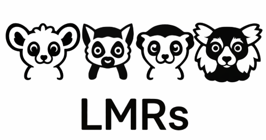
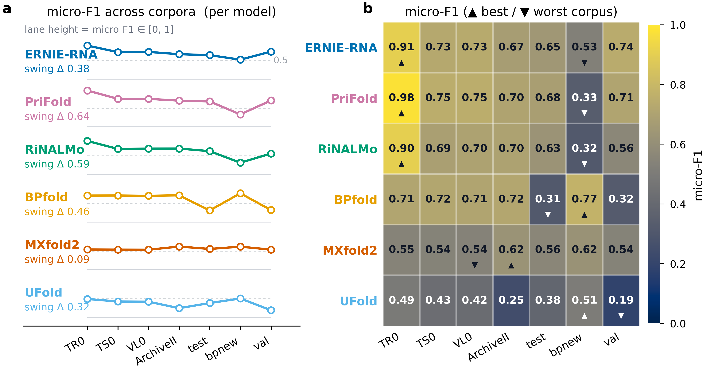
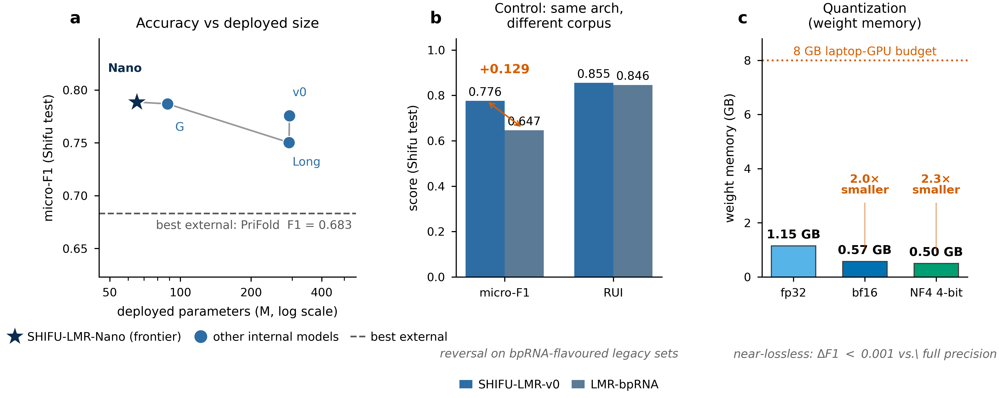
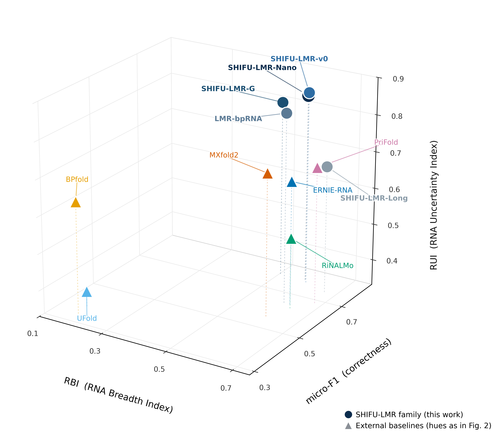
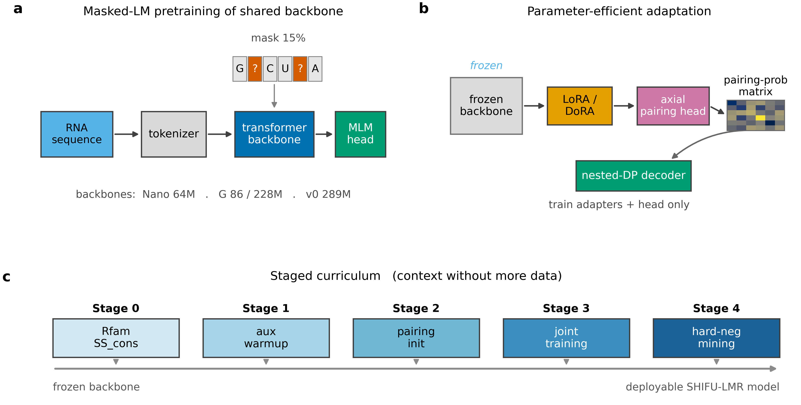

<p align="center">
  
</p>

# LMR: Language Models for RNA

> A leakage-audited RNA benchmark, an honest three-axis evaluation, and compact RNA
> language models that match or beat models 10x their size. The code and models
> behind the **SHIFU** framework.

<p align="center">
  
  
  
</p>

---

## Why LMR?

Most RNA secondary-structure models look excellent on their home benchmark and
collapse on the next one, because most benchmarks measure **memorization, not
generalization**. Run one model across several public benchmarks and its accuracy
swings from near-perfect to near-chance:

<p align="center"></p>
<p align="center"><i>Same models, seven public splits. The instability is the data and the
measurement, not the model. This is the problem SHIFU is built to fix.</i></p>

LMR rebuilds the foundation so a number means something:

- **An honest benchmark.** SHIFU-Corpus is 254,123 sequences from six databases,
  deduplicated and **certified with zero exact and zero near-duplicate train/test
  leaks**, with family-disjoint splits. A high score here reflects generalization,
  not a leaked test set.
- **Evaluation that shows where models fail.** The **SHIFU Trifecta** scores
  correctness, breadth across out-of-distribution data, and whether a model's
  confidence is actually usable, instead of one number that hides everything.
- **Small models that punch far above their weight.** A 65M-parameter backbone
  reaches **micro-F1 0.789 vs RiNALMo's 0.627 (650M)**, and swapping only the
  training corpus moves accuracy by **0.13**, proof that the bottleneck is data and
  representation, not scale. Everything runs on a laptop GPU.

<p align="center"></p>

**Use LMR if you want** a trustworthy RNA-structure benchmark, a compact RNA
language-model backbone to fine-tune, or a leakage-free baseline that cannot be
gamed by test-set overlap.

## The SHIFU Trifecta

<p align="center"></p>

Three orthogonal axes, so no single number can hide a weakness: **micro-F1**
(correctness), **RBI** (breadth = how well a model holds up on its hardest,
out-of-distribution units), and **RUI** (whether its confidence ranks hard cases
correctly). A model can be accurate but narrow, broad but blind, or genuinely
strong on all three, and the Trifecta tells them apart.

## Foundational models

Four pretrained RNA backbones on HuggingFace (weights); configs and training code
are in this repo.

| Model | Params | Context | HuggingFace | Weights |
|---|---|---|---|---|
| LMR-v0 | 289M | 512 | [GaboG7/LMR-v0](https://huggingface.co/GaboG7/LMR-v0) | `git clone https://huggingface.co/GaboG7/LMR-v0` |
| LMR-G | 228M | 512 | [GaboG7/LMR-G](https://huggingface.co/GaboG7/LMR-G) | `git clone https://huggingface.co/GaboG7/LMR-G` |
| LMR-nano | 65M | 512 | [GaboG7/LMR-mini](https://huggingface.co/GaboG7/LMR-mini) | `git clone https://huggingface.co/GaboG7/LMR-mini` |
| LMR-Long | 290M | 4,096 | [GaboG7/LMR-Long](https://huggingface.co/GaboG7/LMR-Long) | `git clone https://huggingface.co/GaboG7/LMR-Long` |

*Only the 228M LMR-G backbone is released; the smaller 86M LMR-G is not (its config `lmr_g.yml` is included for replication only).*

## Installation

```bash
git clone https://github.com/Vicens-Lab/LMR
cd LMR
python -m venv .venv && source .venv/bin/activate     # Windows: .venv\Scripts\Activate.ps1
pip install -r requirements.txt
```
Python >= 3.9. Dependencies are just `torch`, `numpy`, `pyyaml` (plus
`huggingface_hub`/`safetensors` to pull weights).

## Runs on any hardware

The code **auto-detects your device** (CUDA -> Apple Silicon MPS -> CPU); nothing is
hardcoded to a GPU, mixed precision is enabled only on CUDA, and multi-GPU is optional.
Confirm it runs on your machine:

```bash
python example.py                                              # LMR-nano, auto device
python example.py --long --config foundational/configs/lmr_long.yml
python example.py --checkpoint path/to/weights.pt             # load a pretrained backbone
```

Single device by default; scale out with `torchrun --nproc_per_node=N
foundational/train.py ...`. Full pretraining of the larger backbones still wants a CUDA
GPU, but everything loads and runs on CPU or Apple Silicon for development and inference.

## Get the dataset

**SHIFU-Corpus** (254,123 sequences, leakage-audited, family-disjoint splits) is on
HuggingFace: [GaboG7/SHIFU-Corpus](https://huggingface.co/datasets/GaboG7/SHIFU-Corpus).

```bash
huggingface-cli download GaboG7/SHIFU-Corpus --repo-type dataset --local-dir ./shifu_corpus
```
The split integrity is provable offline from `data/benchmark_certificate/`
(0 exact + 0 cluster leaks, per-split composition, byte-level hashes).

## Fine-tune

The backbones are pretrained by masked language modeling, then adapted with
parameter-efficient heads and a staged curriculum, no extra data required:

<p align="center"></p>

```bash
export DATA_ROOT=/path/to/your/data        # replaces <DATA_ROOT> in the configs

# 1. pull a backbone
git clone https://huggingface.co/GaboG7/LMR-v0 $DATA_ROOT/checkpoints/lmr_v0

# 2. reproduce / continue foundational pretraining
PYTHONPATH=. python foundational/train.py      --config foundational/configs/lmr_v0.yml
PYTHONPATH=. python foundational/train_long.py --config foundational/configs/lmr_long.yml

# 3. for a 2D structure model, start from a backbone + a config in models_2d/configs/
#    (config provided for replication; see models_2d/README.md)
```
Edit the `<DATA_ROOT>` paths in the chosen config to point at your corpus and
checkpoint directory.

## Evaluation & data utilities

We provide the paper's evaluation code as **utilities you integrate as needed**, not
a turnkey pipeline. You wire in your own 2D model's predictions; the scoring and
metrics are the paper's, so your numbers stay comparable.

- `utils/scoring.py` — score one prediction: base-pair precision/recall/F1 (+ entropy).
- `utils/trifecta.py` — compute the Trifecta (micro-F1, RBI, RUI) from per-sequence results.
- `utils/data_pipeline.py` — load SHIFU-Corpus records (sequence + reference) for eval;
  training streaming uses `data/pytorch_wrapper.py`.

Recipe: load records, run your model, score with `basepair_set_prf1`, aggregate with
`trifecta.py`. Take only the pieces you need; full guide in `utils/README.md`.

## Repository layout

```
lmr_g/  model/        foundational backbone architectures (standard + long-context)
tokenizer.py          minimal RNA tokenizer
data/  training/      masked-language-model data + training utilities
foundational/
  configs/            lmr_v0 / lmr_nano / lmr_g / lmr_g_160 / lmr_long
  train.py            MLM trainer (v0 / nano / G)
  train_long.py       long-context MLM trainer (LMR-Long)
models_2d/
  configs/            lmr_shifu.yml, lmr_bprna.yml   (config only; no weights/scripts)
data/benchmark_certificate/   split leakage / dedup / label audit
assets/               figures
```

## Citation

If you use SHIFU in your research, please cite our bioRxiv preprint:

```bibtex
@article{Galvez2026.07.15.738762,
  author        = {Galvez, Gabriel Cardenas and Vicens, Quentin},
  title         = {Shifu: an integrated framework for deep learning of RNA secondary structure},
  elocation-id  = {2026.07.15.738762},
  year          = {2026},
  doi           = {10.64898/2026.07.15.738762},
  publisher     = {Cold Spring Harbor Laboratory},
  journal       = {bioRxiv},
  url           = {https://www.biorxiv.org/content/early/2026/07/16/2026.07.15.738762},
  eprint        = {https://www.biorxiv.org/content/early/2026/07/16/2026.07.15.738762.full.pdf}
}
```

If you use the SHIFU software implementation directly, please also cite this repository.

## License

Code is released under the **MIT License** (see `LICENSE`). SHIFU-Corpus is derived
from six public databases (RNASSTR, bpRNA, RNAStrAlign, ArchiveII, DSSR, RNAsolo)
that retain their own licenses; cite and honor the original sources when using the data.

*Vicens Lab, Center for Nuclear Receptors and Cell Signaling, University of Houston.*
